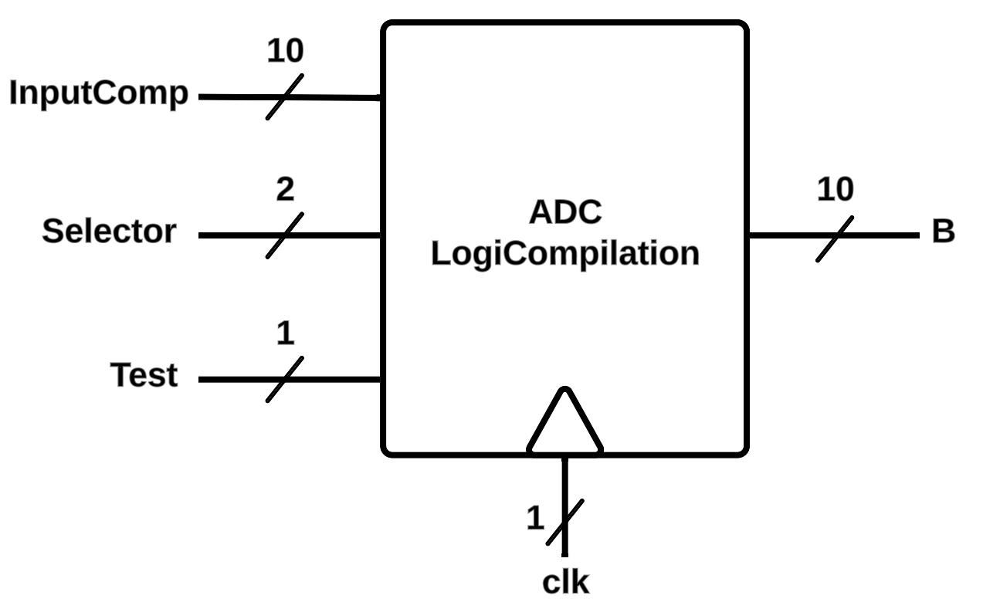

# ADC LogiCompilation

  

## Project Description:

Compilation of three different ADC digital logics for GFMPW-1. The simplified input/output schematic is as follows:

When the *Test* is turned *ON*, the internal circuits switch to comparison mode, and the output varies based on *InputComp*. If *Test* is off, the output remains *zero*.

Using *Selector*, users can switch between 4 different modes:

- Off (*Selector* = 00): No design is active.
- Flash (*Selector* = 01): It utilizes a *thermometer code* from seven comparators and generates a 3-bit output using a simple decoder. If the input code is invalid, outputs *B* and *BN* are set to 0 and 1 respectively.

- Conventional SAR (*Selector* = 10): This takes a 10-bit input from comparator and introduces it as a sequence. Each clock cycle uses each bit to determine its corresponding output, with the next bit being set to 1. After 10 cycles, the 10-bit output is defined.
- Monotonic SAR (*Selector* = 11): Similar to conventional SAR logic, but it doesn’t set the next iteration's bit to 1. This creates different consequences in the complete implementation, altering the switching scheme. However, in this case, such alterations are not expected, and the output is anticipated to be similar to the conventional example.

## Final GDS Result in Klayout:

